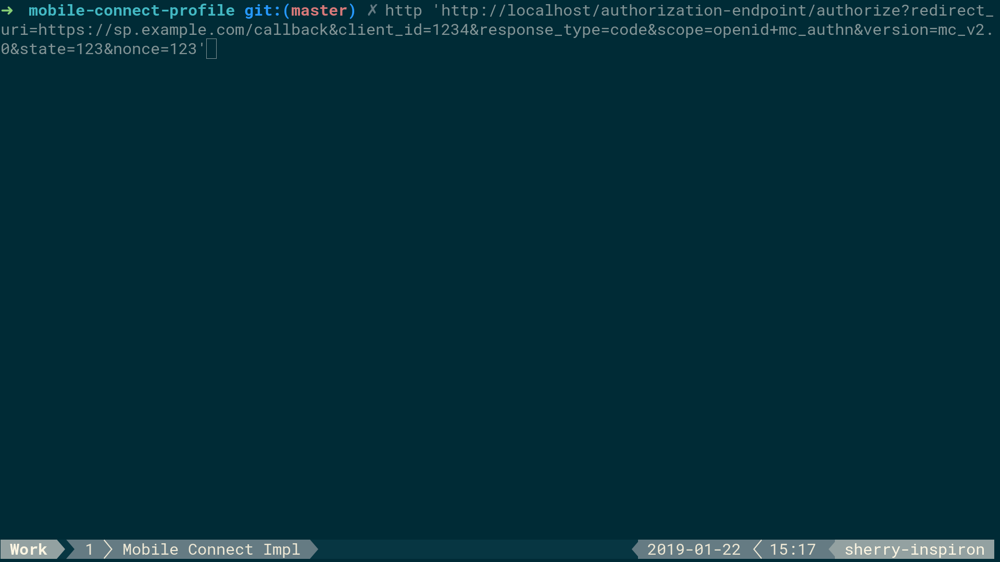
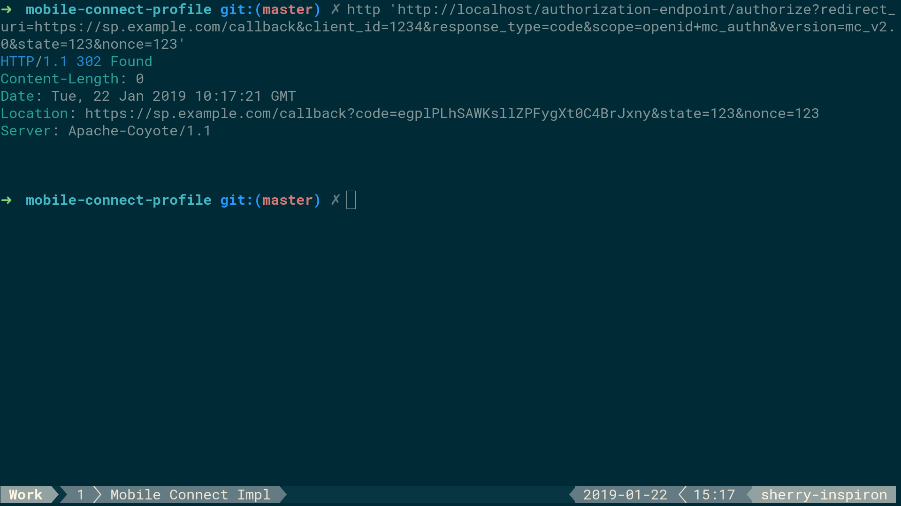
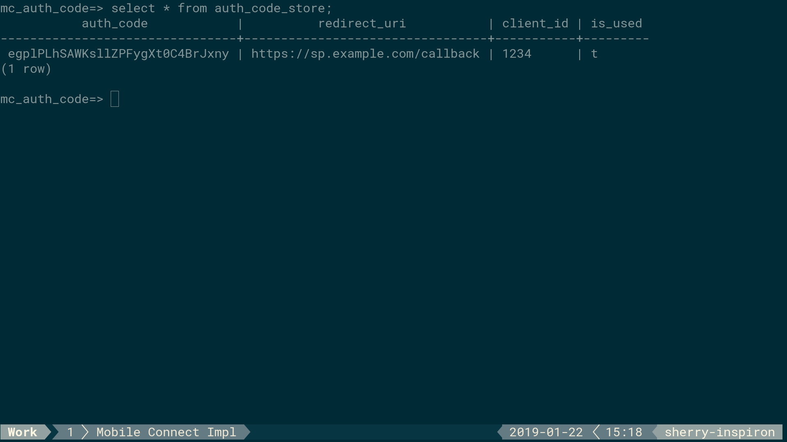

# User Guide

[Project Demo](#demo)

[Authentication Endpoint](#authentication-endpoint)

1. [HTTP Methods Supported](#http-methods-supported)
1. [Request Validation](#request-validation)
1. [Configuration](#configuration)

[Token Endpoint](#token-endpoint)

1. [HTTP Methods Supported](#http-methods-supported-1)
1. [Request Validation](#request-validation-1)
1. [Configuration](#configuration-1)

[Discovery Document](#discovery-document)

1. [HTTP Methods Supported](#http-methods-supported-2)
1. [Request Validation](#request-validation-2)
1. [Configuration](#configuration-2)

# Demo

#### Ensure Client is registered to database

This table will be used when validating Authorization Endpoint Request.

#### Send Valid Request

This is a valid request, having valid **client_id** and **redirect_uri**.

#### Response of Authentication Request

The response contains a Location header, having the **redirect_uri** and **code** as query parameter

#### Authorization Code Database

The code that is given to the client, is registered in the database. This can also be used for logging.

You can see there is a column called **is_used** which denotes if the code has been used by Token Endpoint.

#### Token Request

We now send a token request that has valid parameters, including the code we just got.

The Authorization Header contains the hash of **client_id:client_secret**, which is **Base64 Encoded**.

#### Token Request Response

We get a successful token response. I have yet to implement Token Response. So this is the placeholder for now :D

#### Authorization Code Database

The Authorization Code in the database is now marked as used, which ensures the same code is not used again.

# Authentication Endpoint

### HTTP Methods Supported

The Authentication Endpoint accepts both **GET** and **POST** requests.

### Request Validation

**All mandatory parameter validations are implemented.**

Some optional parameters have yet to be implemented. The request will still work.

### Configuration

You should only be required to change the **config.properties** file to modify the **database driver and connection**, in case you're using a different database and/or different table names.

You should follow the schema in the demo as that's what I had in mind during implementation. The project in its current state will not function properly if you decide to use a different schema.
Though if I find time I might work on that but its unlikely I will.

# Token Endpoint

### HTTP Methods Supported

The Authentication Endpoint accepts **POST** requests only, as specified in [OpenID Connect Core Specificaion](https://openid.net/specs/openid-connect-core-1_0.html#TokenRequest).

### Request Validation

**All mandatory parameter validations are implemented.**

### Configuration

Same rules as Authentication Endpoint's Configuration.

# Discovery Document

### HTTP Methods Supported

The Authentication Endpoint accepts **GET** requests only, as specified in the [OpenID Connect Core Specificaion](https://openid.net/specs/openid-connect-discovery-1_0.html#ProviderConfigurationRequest).

### Request Validation

There are no query parameters to send to this endpoint.

### Configuration

You will only need to modify **config.properties** file to setup the values of the different keys in the JSON body.
